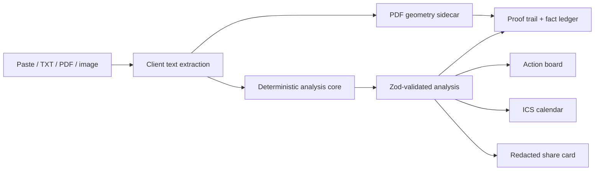

# Architecture

## Product boundary

The primary product path is local-first:

Pasted and extracted text is passed directly to `analyzeDocument` in the browser. No upload or API request is made by the workspace. `/api/analyze` is a separate, explicit text-only adapter for future agents and integrations.

## Core modules

| Module | Responsibility |
| --- | --- |
| `src/core/schema.ts` | Zod contract, explicit date-only flags, and exact evidence-span validation |
| `src/core/analyze.ts` | Document classification, chrono-node candidates, domain regex/rules, normalization, actions, uncertainty |
| `src/core/conflicts.ts` | Deterministic contradiction detection |
| `src/core/redact.ts` | Sensitive-data removal and safe share projection with document-kind-only titles |
| `src/core/ics.ts` | RFC 5545 calendar serialization with all-day dates, document-scoped stable UIDs, and UTF-8 line folding |
| `src/core/samples.ts` | Three labeled demo inputs; no stored fake results |
| `src/lib/extract-document.ts` | Browser-only TXT/PDF/OCR extraction |
| `src/lib/pdf-source-locator.ts` | Strict PDF-sidecar validation and evidence-offset-to-page lookup |
| `src/lib/presentation.ts` | Proof segmentation, confidence display, share SVG |
| `src/components/pdf-evidence-preview.tsx` | Original-page PDF.js canvas and highlight overlay with render fallback |

The browser and API import the same `analyzeDocument(text, options)` function. Sample outputs are generated at runtime by that function.

## Analysis pipeline

1. Split source text into lines while retaining absolute character offsets.
2. Detect conservative domain patterns: money, state, references, airport locations, dates, deadlines, and travel events.
3. Use chrono-node for date candidates, then preserve explicitness flags for year, time, timezone, and date-only/all-day meaning.
4. Normalize known timezone abbreviations to fixed-offset IANA zones and ISO values while retaining the source abbreviation and UTC offset; regional daylight-saving rules never reinterpret an explicit abbreviation. Date-only values remain `YYYY-MM-DD` instead of passing through timezone conversion. Missing components remain explicit uncertainties.
5. Suppress duplicate normalized events.
6. Detect semantically related contradictory deadlines.
7. Derive actions only from facts with cited source spans.
8. Validate the completed object with Zod, including `sourceText.slice(start, end) === quote` for every fact.

The parser is intentionally conservative. A missing value is omitted or flagged; it is not generated. Instruction-like text inside documents is inert data.

## Browser extraction

- TXT: native `File.text()`.
- PDF: dynamically loaded `pdfjs-dist`, `getTextContent()` per page, processed in-browser while preserving `TextItem.hasEOL` line boundaries and reconstructing punctuation-safe spacing between adjacent items. Canonical text and normalized geometry runs are emitted together so page markers, whitespace normalization, and UTF-16 offsets cannot drift.
- Images: dynamically loaded `tesseract.js` worker. If worker/model initialization or recognition fails, the interface tells the user to use a clearer image or paste text.

The PDF geometry map is an optional browser-local sidecar. It does not modify `Evidence`, `Analysis`, API payloads, or canonical offsets. A locator is returned only when valid, non-overlapping whole geometry runs exactly cover the selected evidence on one unrotated page. Evidence that begins or ends inside a PDF.js text item is not approximated with inferred glyph widths; it returns no locator. Malformed, rotated, cross-page, duplicate/ambiguous, partial-run, incomplete, or stale geometry likewise returns no locator. OCR overlays are intentionally deferred.

PDF bytes and image bytes are never sent to LifeOps server routes. A PDF `File` is retained only for the active local result so its selected page can be rendered, then released when the user edits or replaces the document; it is never persisted. Tesseract may download its language/runtime assets on first use; recognition stays in the local worker.

## UI architecture

The experience uses an intake-to-workbench flow rather than a generic dashboard. The result screen has two linked panes: source and fact ledger. For a safely located PDF fact, the source pane renders the original page with one or more geometry overlays and retains an assistive-text equivalent of the surrounding canonical source. Any absent/invalid locator or page-render failure uses the unchanged exact text highlight. Selecting a fact scrolls the active proof into the fixed-height source pane, using instant rather than smooth scrolling when reduced motion is preferred. Motion handles only result and action entry; all important controls have CSS hover, active, focus, disabled, error, and loading states with a reduced-motion fallback.

The visual structure drew on current document-product citation patterns—especially linked source navigation in [Adobe Acrobat AI Assistant](https://helpx.adobe.com/acrobat/using/get-ai-generated-answers.html)—and unified multi-format intake patterns in [Dropbox Dash](https://dash.dropbox.com/features/universal-search). LifeOps differs by using deterministic extraction, visible conflicts, a local-first browser path, and executable calendar output.

## Technology choices

- Next.js App Router + React + TypeScript
- Zod and chrono-node for the deterministic contract/core
- PDF.js and Tesseract.js for local document extraction
- Lucide for coherent accessible iconography
- Motion for state choreography
- Vitest, Testing Library, and Playwright for verification

No database, account system, LLM, analytics SDK, or external API key is required.
